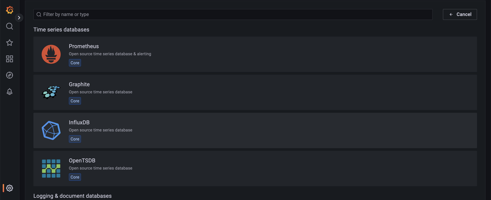

# Ingesting-ZR-Plus-Optics-Telemetry-from-JunosEVO-via-Openconfig-and-Grafana-InfluxDB-JTIMON-Stack

## Aim
* In this wiki I will explain how to export ZR+ optics telemetry information from Junos EVO via gNMI and Ingesting that info via Grafana , InfluxDB and JTIMON Stack.
* Acknowledgment- Ground breaking work was done by Anton-Alita [Reference](https://github.com/a-elita) and [Reference](https://community.juniper.net/blogs/anton-elita/2022/07/18/telemetry-collector-and-dataviz-on-junos-evo?CommunityKey=44efd17a-81a6-4306-b5f3-e5f82402d8d3)
## References 
* Junos supports Openconfig working group gNMI specifications to export operational states via Junos Telemetry Interface [Reference](https://www.juniper.net/documentation/us/en/software/junos/grpc-network-services/topics/concept/grpc-services-overview.html#:~:text=Whereas%20gNMI%20handles%20state%20management,common%20operations%20on%20network%20devices.)
* Details about Junos Telemtry Interface can be obtained from [Reference](https://www.juniper.net/documentation/us/en/software/junos/interfaces-telemetry/topics/concept/junos-telemetry-interface-oveview.html)
* Details about Openconfig gNMI specfications for Junos Telemtry Interface can be obtained from [Reference](https://www.juniper.net/documentation/us/en/software/junos/interfaces-telemetry/topics/concept/open-config-grpc-junos-telemetry-interface-understanding.html)
* [JTIMON](https://github.com/nileshsimaria/jtimon)
## Execution
### Preparing Junos Device
```
config 
set system services extension-service request-response grpc clear-text port 32767
set system services extension-service request-response grpc max-connections 30
set system services extension-service request-response grpc skip-authentication
commit and quit
```
### Preparing Mgmt Client (Ubuntu 20.04)
* Installation instructions for Go language can be found on [Reference](https://go.dev/doc/install)
* Installation instructions for docker-ce can be found on [Reference](https://docs.docker.com/engine/install/ubuntu/)
* Clone JTIMON git repo. 
```
cd ~
 git clone https://github.com/nileshsimaria/jtimon.git
```
* Build container image
```
cd ~/jtimin
make docker 
docker images
REPOSITORY        TAG                 IMAGE ID       CREATED       SIZE
jtimon            latest              46ac91eb129b   2 weeks ago   25.9MB
```
* Make required directories for docker volumn mounting
* I have used a seprate hdd and mounted it on /mnt/influx
```
mkdir -p /mnt/influx/grafana/dashboards
chmod -R 777 /mnt/influx/grafana/dashboards/
mkdir -p /mnt/influx/influxdb
```
* Preparing Config Files 
```
cat <<EOF > /mnt/influx/influxdb/env
INFLUXDB_DB=telegraf
INFLUXDB_USER=telegraf
INFLUXDB_ADMIN_ENABLED=true
INFLUXDB_ADMIN_USER=admin
INFLUXDB_ADMIN_PASSWORD=lab123
EOF

cat <<EOF > /mnt/influx/jtimon-optical-infux.conf 
{
    "port": 32767,
    "host": "junos-evo-mgmt-ip",
    "user": "user",
    "password": "password",
    "cid": "jtimon",
    "grpc": {
        "ws": 524288
    },
    "paths": [
        {
            "path": "/components/component/optical-channel",
            "freq": 120000
        },
       {
        "path": "/components/component/state/",
         "freq": 120000
       },
       {
        "path": "/components/component/transceiver/",
         "freq": 120000
       },
       {
        "path": "/components/component/",
         "freq": 120000
       },
       {
        "path": "/interfaces/interface/",
         "freq": 120000
       },
       {
        "path": "/junos/interface-information/",
         "freq": 120000
       }
    ],
    "influx": {
        "server": "127.0.0.1",
        "port": 8086,
        "dbname": "telegraf",
        "user": "admin",
        "password": "lab123",
        "recreate": false,
        "measurement": "optical"
    },
    "log": {
        "file": "",
        "periodic-stats": 0,
        "verbose": false
    },
    "vendor": {
        "name": "",
        "remove-namespace": false,
        "schema": null
    },
    "alias": "",
    "password-decoder": ""
}
EOF 
```
* Creating Docker containers 

```
docker run \
-d --name grafana \
-v /mnt/influx/grafana/:/var/lib/grafana/ \
-v /mnt/influx/grafana/dashboards:/usr/share/grafana/conf/provisioning/dashboards/ \
-v /etc/localtime:/etc/localtime:ro \
--cap-add=NET_ADMIN \
--network=host \
--restart=always \
grafana/grafana:latest

docker run \
-d --name influxdb \
--env-file=/mnt/influx/influxdb/env \
-v /etc/localtime:/etc/localtime:ro \
-v /mnt/influx/influxdb:/var/lib/influxdb \
--cap-add=NET_ADMIN \
--network=host \
--restart=always \
influxdb:1.8.10

docker run \
-d --name jtimon \
-v /mnt/influx/:/u:ro \
-v /etc/localtime:/etc/localtime:ro \
--cap-add=NET_ADMIN \
--network=host \
--restart=always \
jtimon --config jtimon-optical-infux.conf

docker ps
CONTAINER ID   IMAGE                    COMMAND                  CREATED        STATUS        PORTS     NAMES
0b0f08603577   grafana/grafana:latest   "/run.sh"                11 hours ago   Up 11 hours             grafana
b2c28cfe91c7   jtimon                   "/usr/local/bin/jtim…"   2 weeks ago    Up 10 hours             jtimon
f665e5711554   influxdb:1.8.10          "/entrypoint.sh infl…"   2 weeks ago    Up 10 hours             influxdb
```
* Login into Grafana GUI using admin/admin credentials
```
http://mgmt-client-ip:3000
```
* Add new data source into Grafana GUI, open following URL

```
https://mgmt-client-ip:3000/datasources/new
```
* Click on InfluxDB once you are on following screen


* In the next window provide following paramters.

```
url:                http://localhost:8086
database:           telegraf
username:           admin   
password:           lab123
```
* Click on save & test and it should return message "datasource is working"
* Open following URL to  add and populate Grafana dashboard
```
http://mgmt-client-ip:3000/datasources/new
```
* Click on New -> Import on the next screen 
* On next screen click on "Upload JSON File"
* Uploaed zr-plus-optics.json file and it shall populate Grafana dashboard (yet not uploaded with this git repo)
* Following parameters for ZR+ optics would be displayed in the Grafana
* [Reference](https://www.oiforum.com/wp-content/uploads/OIF-C-CMIS-01.0.pdf)

```
- Tx Power, 
- Wavelength (nm & THz), 
- Speed, 
- FEC, 
- Rx Total Power and Signal Power (dBm and mW),
- Tx Power, 
- Module temperature, 
- Carrier offset, 
- Pre-FEC bit error rate, 
- Uncorrected FEC, 
- Carrier offset frequency, 
- OSNR, 
- SOPMD, 
- PDL
- Laser Frequency Error
- Pre-FEC BER
- Chromatic disperion (CD)
- DGD
- PDL
- SOPMD
- OSNR
- eSNR
- Tx Power
- Rx Total Power
- SOP
```